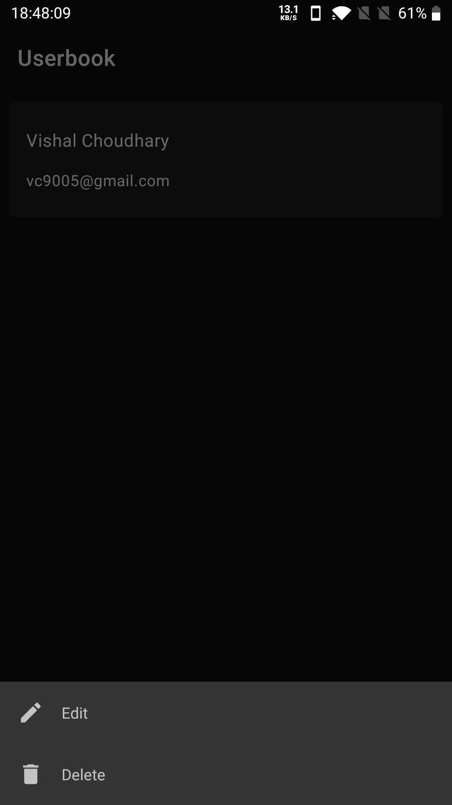

## Userbook

App to showcase a list of Users. User can add or edit a user.

Download ([APK](https://github.com/vishal1337/Userbook/raw/master/apk_files/userbook_app.apk))

<table>
  <tr>
    <td>Home screen (No Users)</td>
    <td>Add User Screen</td>
    <td>Home screen</td>
  </tr>
  <tr>
    <td></td>
    <td></td>
    <td></td>
  </tr>
  <tr>
    <td>User item options</td>
    <td>Edit User Screen</td>
  </tr>
  <tr>
    <td></td>
    <td></td>
  </tr>
</table>

# Description
- Show a list of users stored in local db.
- User can add or edit or delete a User.

# Highlights

- MVVM Architecture - To Organize Code
- Kotlin - Language used to write this Project
- Hilt - For Dependency Injection
- Coroutines - To offload work from Main Thread
- Room - Database Wrapper for SQLIte
- View Binding - view binding.
- Data Binding - data binding.
- LiveData - Observable data holder class
- ViewModel - to store and manage UI-related data in a lifecycle conscious way
- Navigation - To facilitate Navigation from one Screen to another